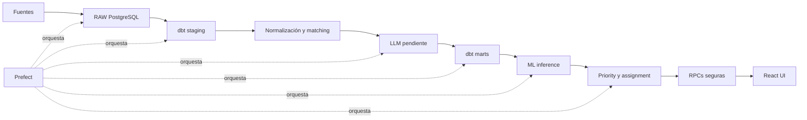

# RetoMotors

RetoMotors es una solución de gestión comercial para priorizar y organizar la atención de leads del sector motocicletas. Integra fuentes operativas, normaliza y relaciona datos, analiza conversaciones, cruza catálogo y disponibilidad, construye una señal histórica de propensión y genera una jornada priorizada con asignación de asesores por empresa, punto de venta y capacidad.

La solución combina Data Engineering, Analytics Engineering, LLM, Machine Learning, reglas de negocio, orquestación, seguridad de datos y una aplicación React. No es únicamente un modelo de IA: la decisión operacional final es determinística, explicable y auditable.

**Producción:** [https://retomotors.vercel.app](https://retomotors.vercel.app)

El frontend está desplegado en Vercel. PostgreSQL, Auth, RPCs seguras y Edge Functions viven en Supabase. No hay credenciales de demostración públicas en este repositorio.

## Tabla de contenidos

- [1. Problema](#1-problema)
- [2. Solución](#2-solución)
- [3. Flujo end-to-end](#3-flujo-end-to-end)
- [4. Arquitectura técnica](#4-arquitectura-técnica)
- [5. Tecnologías y por qué](#5-tecnologías-y-por-qué)
- [6. Estructura del repositorio](#6-estructura-del-repositorio)
- [7. Requisitos](#7-requisitos)
- [8. Variables de entorno](#8-variables-de-entorno)
- [9. Datos de entrada](#9-datos-de-entrada)
- [10. Instalación local](#10-instalación-local)
- [11. Pipeline completo](#11-pipeline-completo)
- [12. dbt](#12-dbt)
- [13. Procesamiento LLM](#13-procesamiento-llm)
- [14. Machine Learning](#14-machine-learning)
- [15. Priorización y asignación](#15-priorización-y-asignación)
- [16. Tracking de gestión](#16-tracking-de-gestión)
- [17. Orquestación con Prefect](#17-orquestación-con-prefect)
- [18. Supabase](#18-supabase)
- [19. Frontend](#19-frontend)
- [20. Help Assistant / mini-RAG](#20-help-assistant--mini-rag)
- [21. Referencia de comandos](#21-referencia-de-comandos)
- [22. Testing y calidad](#22-testing-y-calidad)
- [23. CI/CD y operación](#23-cicd-y-operación)
- [24. Seguridad](#24-seguridad)
- [25. Decisiones de diseño](#25-decisiones-de-diseño)
- [Supuestos asumidos](#supuestos-asumidos)
- [Qué haría con más tiempo](#qué-haría-con-más-tiempo)
- [26. Limitaciones conocidas](#26-limitaciones-conocidas)
- [27. Ejecución en producción](#27-ejecución-en-producción)
- [28. Troubleshooting](#28-troubleshooting)
- [29. Estado final del proyecto](#29-estado-final-del-proyecto)

## 1. Problema

La operación comercial recibe leads de distintas fuentes y necesita decidir qué oportunidad atender primero, quién puede atenderla y qué contexto debe conocer el asesor. Una probabilidad de cierre aislada no resuelve la urgencia, la antigüedad, la disponibilidad del producto ni la capacidad del equipo.

Los retos principales son:

- integrar fuentes con esquemas y calidades diferentes;
- relacionar leads, catálogo, asesores y conversaciones sin perder lineage;
- extraer señales del lenguaje natural sin convertir la extracción en reglas opacas;
- evitar leakage en el modelo histórico;
- priorizar con reglas comprensibles para el negocio;
- respetar empresa, punto de venta, elegibilidad y capacidad;
- exponer los datos mediante una capa segura, no mediante grants directos a tablas internas.

## 2. Solución

RetoMotors construye una jornada comercial reproducible:

1. carga las fuentes en RAW con control de hash e idempotencia;
2. limpia y tipifica con dbt;
3. normaliza modelos y cruza catálogo/disponibilidad;
4. resuelve identidad y conserva relaciones ambiguas para auditoría;
5. procesa únicamente conversaciones pendientes con extracción estructurada;
6. materializa features de conversación y un mart enriquecido;
7. ejecuta inferencia de propensión histórica sin reentrenar diariamente;
8. calcula un priority score determinístico;
9. asigna leads a asesores activos respetando empresa, tienda y capacidad;
10. expone la jornada con Auth y RPCs seguras en una aplicación React.

La propensión responde «qué probabilidad histórica tiene un lead de cerrar». La prioridad responde «a cuál conviene atender primero ahora». Por eso la propensión es una señal auxiliar de máximo 5 puntos, mientras que las señales conversacionales, la antigüedad y la disponibilidad tienen mayor peso.

## 3. Flujo end-to-end



El Help Assistant es un flujo auxiliar separado: documentación curada → PostgreSQL Full Text Search → Edge Function → GPT-5 Nano. No participa en el cálculo de prioridad ni recibe contexto de leads.

## 4. Arquitectura técnica

El código Python vive en `src/reto_ia/`; el código SQL de transformaciones vive en `dbt/`; las migraciones y Edge Functions de Supabase viven en `supabase/`; y el cliente web vive en `frontend/`.

Las transformaciones dbt se ejecutan desde el repositorio, pero sus modelos materializados viven en PostgreSQL/Supabase:

- `raw`: copias tipificadas de las fuentes y metadata de ingestión.
- `staging`: limpieza, tipificación, normalización inicial y estados de parseo.
- `intermediate`: matching, disponibilidad, identidad, selección de extracción vigente y auditorías.
- `marts`: modelos consumibles por ML, prioridad y aplicación.
- `ai`: extracciones estructuradas y checkpoint.
- `ml`: scores de propensión persistidos.
- `ops`: ejecuciones de ingestión y asignaciones diarias.
- `app`: perfiles de acceso y documentación del Help Assistant.

En `dbt/dbt_project.yml`, `staging` e `intermediate` se materializan como views, mientras `marts` se materializa como tables. Los seeds de aliases viven en el schema intermedio.

## 5. Tecnologías y por qué

| Tecnología | Uso en RetoMotors | ¿Por qué? |
|---|---|---|
| Python 3.12 | Ingesta, extracción, ML, prioridad y orquestación | Unifica la lógica operacional y permite reutilizar CLIs en Prefect. |
| uv | Entorno y dependencias Python | Reproduce instalación mediante `pyproject.toml` y `uv.lock`. |
| PostgreSQL | Persistencia RAW, analítica y operación | Soporta relaciones, JSONB, constraints, FTS y consultas seguras en un mismo motor. |
| Supabase | PostgreSQL, Auth, RPCs y Edge Functions | Evita construir un backend CRUD separado y concentra controles server-side. |
| dbt Core / dbt-postgres | Staging, intermediate, marts y tests SQL | Separa transformaciones SQL de Python, documenta capas y permite construir/testear modelos. |
| Pandas | DataFrames de ingesta, features y evaluación | Es suficiente para el volumen del assessment y mantiene la lógica legible. |
| Pydantic / pydantic-settings | Contratos estructurados y configuración | Valida extracción LLM y centraliza variables de entorno. |
| RapidFuzz | Matching de modelos de catálogo | Permite fuzzy matching controlado después de normalización y aliases. |
| OpenAI + `langchain-openai` | Extracción semántica y generación grounded | Se usa donde el lenguaje natural lo requiere, con contratos y contexto acotados. |
| scikit-learn | Entrenamiento e inferencia de propensión | Logistic Regression es un baseline interpretable para una señal histórica limitada. |
| Logistic Regression | `propensity_logistic_v1` | Permite inspeccionar coeficientes y evita justificar complejidad sin evidencia. |
| Prefect 3 | Orquestación diaria | Coordina las CLIs existentes con estados, logs y fail-fast. |
| React + TypeScript + Vite | Aplicación comercial | Entrega una SPA tipada y simple de desplegar. |
| Supabase JS + React Router | Auth, RPCs y navegación | Conecta el navegador a la superficie segura y soporta rutas protegidas. |
| PostgreSQL Full Text Search | Retrieval del Help Assistant | El corpus es pequeño y estructurado; evita una vector DB innecesaria. |
| Supabase Edge Functions | Backend server-side del Help Assistant | Mantiene `OPENAI_API_KEY` fuera del navegador. |
| GitHub Actions | CI y refresh operacional manual | Reproduce checks y opera sobre RAW persistida sin subir fuentes privadas. |
| Vercel | Frontend de producción | Despliega el SPA Vite con integración Git y fallback para BrowserRouter. |

## 6. Estructura del repositorio

```text
RetoMotors/
├── src/reto_ia/          # Ingesta, LLM, ML, prioridad, Prefect y ayuda
├── dbt/                   # Proyecto dbt, modelos, macros, seeds y tests SQL
├── supabase/              # Migraciones y Edge Functions
├── frontend/              # React/TypeScript/Vite y Vercel
├── knowledge/help/        # Documentación curada del Help Assistant
├── artifacts/ml/          # Artifact versionado para inference
├── reports/               # Métricas y auditorías
├── prompts/               # Prompts versionados de extracción
├── tests/                 # Tests unitarios y de contratos
├── .github/workflows/     # CI y workflow operacional manual
├── data/input/            # Fuentes locales; ignoradas por Git
└── README.md              # Documentación técnica principal
```

## 7. Requisitos

- Git.
- Python 3.12.
- [uv](https://docs.astral.sh/uv/).
- Node.js 20+ y npm para el frontend.
- Acceso a PostgreSQL/Supabase.
- `OPENAI_API_KEY` solo para extracción o generación del Help Assistant.

Supabase CLI y Vercel CLI son opcionales para migraciones, Edge Functions y despliegue.

## 8. Variables de entorno

Copia `.env.example` a `.env` y completa solo lo necesario. `.env` está ignorado por Git.

| Variable | Requerida para | Descripción | Secreta |
|---|---|---|---|
| `DATABASE_URL` | Python, ML, prioridad y Prefect | Connection string de PostgreSQL | Sí |
| `DB_HOST` | dbt | Host PostgreSQL | No necesariamente |
| `DB_PORT` | dbt | Puerto, normalmente `5432` | No |
| `DB_USER` | dbt | Usuario PostgreSQL | Sí |
| `DB_PASSWORD` | dbt | Password PostgreSQL | Sí |
| `DB_NAME` | dbt | Base de datos | No |
| `SUPABASE_URL` | tooling server-side opcional | URL del proyecto Supabase | No |
| `SUPABASE_ANON_KEY` | tooling server-side opcional | Key pública de Supabase | No |
| `SUPABASE_SERVICE_ROLE_KEY` | tooling administrativo server-side | Key privilegiada; nunca frontend | Sí |
| `OPENAI_API_KEY` | LLM y Help Assistant server-side | Credencial OpenAI | Sí |
| `LLM_MODEL_PRIMARY` | extracción | Default: `gpt-5-nano` | No |
| `HELP_CHAT_MODEL` | Help Assistant | Default: `gpt-5-nano` | No |
| `VITE_SUPABASE_URL` | frontend | URL pública del proyecto | No |
| `VITE_SUPABASE_ANON_KEY` | frontend | Publishable/anon key pública | No |

Python usa `DATABASE_URL`; dbt usa `DB_*` porque son clientes con mecanismos de configuración distintos. `VITE_SUPABASE_ANON_KEY` puede contener la publishable key pública. Nunca se debe poner `SUPABASE_SERVICE_ROLE_KEY`, `OPENAI_API_KEY`, `DATABASE_URL` o `DB_PASSWORD` en variables `VITE_*`.

## 9. Datos de entrada

La ingesta requiere, según `REQUIRED_FILES` en `src/reto_ia/ingestion/readers.py`:

| Archivo | Contenido |
|---|---|
| `data/input/leads.csv` | Leads actuales, contacto, canal, empresa, tienda y modelo de interés. |
| `data/input/conversaciones.json` | Conversaciones y mensajes originales asociados a leads. |
| `data/input/catalogo_motos.csv` | Catálogo, precios, unidades y puntos de venta disponibles. |
| `data/input/asesores.csv` | Asesores, empresa, tienda, capacidad y estado activo. |
| `data/input/historico_cierres.csv` | Histórico etiquetado para propensión. |

Estos archivos pueden contener datos del assessment o información comercial. Por eso `data/input/*` y `data/quarantine/*` están ignorados deliberadamente y no se deben codificar como secrets, subir como artifacts ni descargar desde una URL pública.

## 10. Instalación local

### Quick start

```bash
git clone https://github.com/SierraSantiago/RetoMotors.git
cd RetoMotors
uv sync --dev --frozen
```

PowerShell:

```powershell
Copy-Item .env.example .env
```

Unix:

```bash
cp .env.example .env
```

Completa las variables necesarias y coloca las fuentes en `data/input/` si usarás el pipeline completo. Valida dbt:

```bash
uv run dbt debug --project-dir dbt --profiles-dir dbt
```

Para levantar el frontend:

```bash
cd frontend
npm install
npm run dev
```

## 11. Pipeline completo

### Modo A: ejecución local con ingesta

Cuando existen las fuentes en `data/input/`:

```bash
uv run run-daily-pipeline
```

Flujo:

```text
ingestion
→ dbt stg_conversations
→ extracción LLM pendiente
→ dbt build completo
→ inference de propensión
→ priority + assignment
→ validación operacional
```

Se puede fijar la jornada:

```bash
uv run run-daily-pipeline --assignment-date 2026-09-17
```

### Modo B: operational refresh sobre RAW existente

```bash
uv run run-daily-pipeline --skip-ingestion
```

Este modo omite únicamente la ingesta y es el utilizado por GitHub Actions. La fecha puede fijarse con `--assignment-date YYYY-MM-DD`.

### Por qué dbt se ejecuta dos veces

La primera construcción selecciona `stg_conversations` para que las conversaciones RAW queden disponibles al extractor. Después el LLM escribe extracciones y el `dbt build` completo reconstruye los modelos downstream:

```text
RAW conversations → dbt stg_conversations → LLM → dbt full build → marts
```

## 12. dbt

El proyecto está en `dbt/` y usa `dbt-postgres`. dbt no ingiere archivos ni ejecuta el LLM: transforma relaciones persistidas en PostgreSQL, aplica tests y materializa views/tables.

```bash
uv run dbt debug --project-dir dbt --profiles-dir dbt
uv run dbt build --project-dir dbt --profiles-dir dbt
uv run dbt test --project-dir dbt --profiles-dir dbt
uv run dbt build --project-dir dbt --profiles-dir dbt --select stg_conversations
```

- `dbt build` ejecuta modelos y tests en el orden de dependencias.
- `dbt test` ejecuta solo tests.
- `--select stg_conversations` limita la primera etapa a ese modelo y dependencias necesarias.

Los modelos viven en `dbt/models/staging`, `dbt/models/intermediate` y `dbt/models/marts`. `dbt/target/`, `dbt/logs/` y `dbt/dbt_packages/` son artifacts generados y no se versionan.

## 13. Procesamiento LLM

El extractor usa contrato versionado, structured output y checkpoint en PostgreSQL. La ejecución normal solo toma conversaciones pendientes para la combinación vigente de modelo, prompt hash y contrato.

```bash
uv run process-conversations
uv run process-conversations --batch-size 16
uv run process-conversations --limit 10
uv run process-conversations --conversation-id CONV-00001
uv run process-conversations --model gpt-5-nano
uv run process-conversations --dry-run
```

También existen `--retry-errors`, `--force` y `--database-url`, pero no deben usarse en la operación diaria salvo decisión explícita. Una extracción `SUCCESS` compatible se reutiliza, los errores existentes se omiten por defecto y solo las conversaciones pendientes generan nuevas llamadas. `--dry-run` genera cero llamadas OpenAI.

OpenAI se usa para interpretar lenguaje natural de conversaciones y para respuestas grounded del Help Assistant. Matching, scoring, assignment y autorización permanecen determinísticos.

## 14. Machine Learning

El modelo histórico es `LogisticRegression`, versionado como `propensity_logistic_v1`. Usa split temporal y excluye outcome, fechas de cierre, `numero_contactos`, `horas_al_primer_contacto`, identificadores y señales que no están disponibles de forma equivalente en serving.

### Training

```bash
uv run train-propensity
```

Entrenar crea/evalúa el pipeline sklearn y guarda artifacts.

### Inference

```bash
uv run score-propensity
uv run score-propensity --artifact-dir artifacts/ml
```

La inferencia carga `artifacts/ml/propensity_model.joblib` y `artifacts/ml/propensity_metadata.json`, usa el mismo contrato de features y persiste los scores. Si faltan artifacts, falla explícitamente; no entrena automáticamente. `run-daily-pipeline` solo ejecuta inference.

### Resultados actuales

Los valores del artifact/report versionado son:

| Métrica | Valor |
|---|---:|
| ROC-AUC | 0.5235 |
| PR-AUC | 0.1003 |
| Brier score | 0.0838 |
| Tasa positiva de test | 0.0905 |
| Lift Top 20% | 1.2438 |
| Lift FIFO Top 20% | 0.9674 |

La señal predictiva histórica es débil. La propensión no se presenta como certeza de compra ni domina la operación: aporta como máximo 5 de 100 puntos de prioridad.

## 15. Priorización y asignación

El `priority_score` es determinístico y explicable:

| Componente | Máximo |
|---|---:|
| Señales comerciales | 45 |
| Antigüedad / SLA | 30 |
| Disponibilidad | 20 |
| Propensión histórica | 5 |
| **Total** | **100** |

Las señales comerciales incluyen intención, cita, cotización, forma de pago y cuota inicial cuando `cuota_inicial > 0` y `forma_pago = credito`. La antigüedad usa `fecha_registro`; disponibilidad aporta bonus cuando el producto está disponible o es desconocida; propensión usa percentiles relativos.

Temperaturas:

- `HOT`: `priority_score >= 60`.
- `WARM`: `35 <= priority_score < 60`.
- `COLD`: `priority_score < 35`.

El ranking ordena score descendente, lead más antiguo primero y `raw_row_id` como desempate. La asignación exige empresa coincidente, tienda compatible, asesor activo y capacidad disponible. Entre candidatos elegibles selecciona la menor relación `assigned_count / capacidad`, luego cantidad asignada y finalmente `advisor_id`.

Estados:

- `ASSIGNED`: existe asesor compatible y se consumió capacidad.
- `UNASSIGNED_CAPACITY`: había elegibilidad, pero se agotó capacidad.
- `NO_ELIGIBLE_ADVISOR`: no existe asesor activo compatible.

## 16. Tracking de gestión

`Pendiente` y `Respondido` son un estado operacional separado. Marcar un lead como respondido no cambia score, rank, temperatura ni asesor, y tampoco lo elimina de la jornada. El advisor puede marcar/desmarcar sus asignaciones; el manager puede visualizar y filtrar el estado de su empresa.

## 17. Orquestación con Prefect

El flow `reto-motors-daily-pipeline` es una capa delgada sobre implementaciones existentes. Se ejecuta local/in-process y no requiere Prefect Cloud, server permanente, worker, pool ni deployment.

Tasks secuenciales, con `retries=0`:

1. `source-ingestion`.
2. `dbt-conversation-staging`.
3. `pending-conversation-extraction`.
4. `dbt-full-build`.
5. `propensity-inference`.
6. `daily-priority-assignment`.
7. `operational-validation`.

Es fail-fast: una etapa fallida detiene las siguientes. Los logs de subprocess y Prefect quedan en stdout/stderr.

## 18. Supabase

Supabase aporta PostgreSQL, Auth, secure RPCs, RLS y Edge Functions. El navegador no consulta directamente `raw`, `staging`, `intermediate`, `marts`, `ai`, `ml` ni `ops`; la aplicación llama funciones controladas que derivan empresa y advisor desde `auth.uid()` y `app.user_access`.

La capa app incluye perfiles `manager` y `advisor`, consultas de fechas, leads, detalle, dashboard/equipo, historial de conversaciones y la mutación controlada de Respondido. La autorización se aplica server-side y no depende solo de ocultar rutas o botones.

## 19. Frontend

El frontend está en `frontend/` y usa React, TypeScript, Vite, React Router y Supabase JS.

```bash
cd frontend
npm install
npm run dev
npm run lint
npm run build
npm run preview
```

Rutas principales:

- `/leads`: jornada priorizada, filtros y tracking.
- `/leads/:rawRowId`: detalle, prioridad, interés, canales y conversaciones originales.
- `/dashboard`: métricas para manager.
- `/equipo`: capacidad, carga y gestión por asesor.
- `/metodologia`: score y validación ML.

El acceso a dashboard, equipo y metodología depende del rol. El navegador solo necesita `VITE_SUPABASE_URL` y `VITE_SUPABASE_ANON_KEY`.

## 20. Help Assistant / mini-RAG

El Help Assistant es una ayuda autenticada, de solo lectura y sin acceso a datos operativos:

```text
knowledge/help/*.md
→ load-help-knowledge
→ app.help_knowledge
→ PostgreSQL Full Text Search
→ Supabase Edge Function help-chat
→ GPT-5 Nano
→ respuesta + fuentes
```

El corpus es pequeño y estructurado, por lo que FTS evita embeddings, `pgvector` y una vector database. El asistente no tiene tools, SQL, function calling, acciones, memoria persistente ni contexto automático del lead. Saludo, identidad, overview, ayuda, datos vivos y acciones se resuelven determinísticamente cuando corresponde.

```bash
uv run load-help-knowledge
uv run load-help-knowledge --knowledge-dir knowledge/help
```

`OPENAI_API_KEY` permanece únicamente server-side en la Edge Function.

## 21. Referencia de comandos

| Comando | Qué hace | Cuándo usarlo |
|---|---|---|
| `uv run ingest-data` | Ingiera fuentes a RAW idempotentemente | Pipeline local con archivos. |
| `uv run ingest-data --input-dir data/input` | Selecciona el directorio de fuentes | Fuentes en otra ruta. |
| `uv run process-conversations` | Procesa pendientes | Extracción normal checkpoint-aware. |
| `uv run process-conversations --dry-run` | Planifica sin OpenAI | Validación segura. |
| `uv run train-propensity` | Entrena/evalúa artifacts | Entrenamiento explícito. |
| `uv run score-propensity` | Inference con artifact existente | Serving diario. |
| `uv run build-daily-priority` | Calcula/asigna/persiste jornada | Construcción operacional. |
| `uv run build-daily-priority --assignment-date YYYY-MM-DD` | Fija fecha | Reproducibilidad. |
| `uv run build-daily-priority --dry-run` | No escribe asignaciones | Inspección previa. |
| `uv run load-help-knowledge` | Carga Markdown en `app.help_knowledge` | Actualizar ayuda. |
| `uv run run-daily-pipeline` | Pipeline completo con ingesta | Fuentes locales. |
| `uv run run-daily-pipeline --skip-ingestion` | Refresh desde RAW | GitHub Actions/DB existente. |
| `uv run pytest -q` | Tests Python | Validación. |
| `uv run ruff check src tests` | Lint Python | Validación estática. |
| `uv run dbt debug --project-dir dbt --profiles-dir dbt` | Verifica dbt | Diagnóstico. |
| `uv run dbt build --project-dir dbt --profiles-dir dbt` | Construye modelos/tests | Refresh completo. |
| `uv run dbt test --project-dir dbt --profiles-dir dbt` | Ejecuta tests dbt | Validación SQL. |
| `npm run dev` | Servidor Vite | Desarrollo frontend. |
| `npm run lint` | ESLint | Calidad frontend. |
| `npm run build` | TypeScript + Vite build | Verificación de producción. |
| `npm run preview` | Preview del build | Inspección local. |

Las opciones completas se consultan con `--help`. `--retry-errors` y `--force` existen para recuperación controlada, no para la operación diaria.

## 22. Testing y calidad

```bash
uv run pytest -q
uv run ruff check src tests
uv run dbt build --project-dir dbt --profiles-dir dbt
cd frontend
npm run lint
npm run build
```

Los tests cubren contratos de ingesta, matching, identidad, extracción, ML, reconciliación, prioridad, asignación, seguridad de RPC y frontend según el estado del repositorio. CI ejecuta lint/tests Python y build frontend; no llama OpenAI ni ejecuta el pipeline productivo.

## 23. CI/CD y operación

### CI

`.github/workflows/ci.yml` se ejecuta en `push` y `pull_request`. Instala Python con uv, ejecuta Ruff y Pytest, y construye el frontend con Node/npm. No toca datos productivos ni OpenAI.

### Daily Pipeline

`.github/workflows/daily-pipeline.yml` usa únicamente `workflow_dispatch`, sin schedule. Desde GitHub: **Actions → Daily Pipeline → Run workflow**. El input opcional `assignment_date` acepta `YYYY-MM-DD`; vacío significa fecha actual de Colombia. El workflow verifica secrets y artifacts ML y ejecuta:

```bash
uv run run-daily-pipeline --skip-ingestion --assignment-date "$ASSIGNMENT_DATE"
```

El runner no tiene las fuentes privadas, por eso hace operational refresh sobre RAW existente. Un schedule completo requeriría primero una fuente upstream segura como Storage, S3 o una API.

### Vercel

Producción usa el proyecto `retomotors`, Root Directory `frontend`, framework Vite y output `dist`. `frontend/vercel.json` reescribe `/(.*)` a `/index.html` para que BrowserRouter funcione en deep links.

## 24. Seguridad

- `.env` y las fuentes locales están ignorados por Git.
- No se versionan credenciales, PII ni archivos fuente del assessment.
- El navegador recibe solo configuración pública de Supabase.
- `SUPABASE_SERVICE_ROLE_KEY`, `OPENAI_API_KEY`, passwords y connection strings no deben llegar al bundle.
- Auth distingue `manager` y `advisor`.
- RPCs validan `auth.uid()`, empresa, rol y asignación.
- Advisors están restringidos a leads asignados; managers a su empresa.
- El Help Assistant requiere autenticación, es read-only y no consulta leads en vivo.

## 25. Decisiones de diseño

| Decisión | Alternativa | Por qué |
|---|---|---|
| dbt Core | Transformar todo en Python | Las capas SQL, dependencias y tests son visibles en dbt. |
| Prefect | Scripts encadenados manualmente | Reutiliza CLIs y aporta estados/logs sin sistema distribuido. |
| PostgreSQL FTS | Vector DB/embeddings | El corpus de ayuda es pequeño y estructurado. |
| Logistic Regression | Modelos complejos | El histórico tiene señal débil y el baseline es interpretable. |
| Reglas + ML auxiliar | ML-only | Prioridad necesita urgencia, disponibilidad y capacidad. |
| Supabase | Backend CRUD propio | Integra DB, Auth, RLS/RPC y Edge Functions. |
| Vercel | Servidor web propio | Simplifica hosting del SPA Vite e integración Git. |
| Workflow manual | Cron inmediato | No hay upstream seguro de archivos; un schedule sería engañoso. |
| LLM acotado | LLM para toda la lógica | El lenguaje natural requiere interpretación; negocio y seguridad requieren reglas. |

## Supuestos asumidos

- Los archivos entregados representan el universo disponible para este assessment; no se asumió una fuente externa adicional.
- `empresa_id` y `punto_venta_id` son dimensiones confiables para autorización, elegibilidad y asignación.
- `capacidad_diaria_leads` representa la capacidad operacional diaria de cada asesor activo.
- El histórico de cierres es suficientemente útil para construir una señal auxiliar, pero no se trata como una representación completa del futuro.
- Las fuentes llegan como un batch de archivos; no existe todavía un upstream productivo/event-driven para ingesta automática.
- El workflow remoto con `--skip-ingestion` parte de la precondición de que RAW ya fue materializada en PostgreSQL.

## Qué haría con más tiempo

En orden de prioridad:

1. Integrar una fuente upstream segura y versionada para eliminar la dependencia de `data/input/` local; después habilitar un schedule operacional real.
2. Recolectar más resultados comerciales observados y reevaluar la propensión, incluyendo calibración, drift y estabilidad por empresa/tienda.
3. Añadir observabilidad operacional adicional para freshness, calidad de fuentes, errores LLM, latencia y capacidad de asignación.
4. Automatizar pruebas end-to-end autenticadas para manager/advisor, aislamiento por empresa y recorridos críticos del frontend.
5. Formalizar monitoreo periódico de calidad y drift de datos antes de ampliar volumen o cambiar la distribución de leads.

## 26. Limitaciones conocidas

1. El modelo histórico tiene señal predictiva débil; la propensión es auxiliar.
2. La extracción LLM depende de un proveedor externo, aunque usa checkpoint y contratos versionados.
3. La ingesta completa requiere actualmente archivos fuente locales.
4. GitHub Actions hace operational refresh desde RAW, no ingesta.
5. No existe schedule automático porque no hay upstream seguro de nuevas fuentes.
6. Help Assistant no consulta datos operativos vivos.
7. Las distribuciones y reglas deberían reevaluarse al cambiar escala o dataset.

## 27. Ejecución en producción

El frontend publicado está en [retomotors.vercel.app](https://retomotors.vercel.app). Producción requiere `VITE_SUPABASE_URL` y `VITE_SUPABASE_ANON_KEY` en Vercel. Las claves server-side del Help Assistant permanecen en Supabase Edge Functions.

El refresh operacional se ejecuta manualmente desde GitHub Actions o desde un entorno controlado con `--skip-ingestion`. Deben revisarse fecha, RAW, artifacts ML y logs antes de declarar éxito.

## 28. Troubleshooting

### `DATABASE_URL` no configurada

Completa `DATABASE_URL` en `.env` o pasa `--database-url` al CLI que lo soporte.

### dbt no conecta

Completa `DB_HOST`, `DB_PORT`, `DB_USER`, `DB_PASSWORD` y `DB_NAME`, y ejecuta:

```bash
uv run dbt debug --project-dir dbt --profiles-dir dbt
```

### Falta `propensity_model.joblib` o metadata

`score-propensity` falla explícitamente. El pipeline diario no entrena como fallback.

### Falta `OPENAI_API_KEY`

La extracción y el Help Assistant server-side no pueden generar respuestas. No se debe inventar una key ni ponerla en el frontend.

### Frontend: configuración de Supabase ausente

Verifica `VITE_SUPABASE_URL` y `VITE_SUPABASE_ANON_KEY` en el entorno frontend. No pongas una service-role key en el navegador.

### Deep link devuelve 404 en Vercel

Verifica Root Directory `frontend` y que `frontend/vercel.json` conserve el rewrite `/(.*) → /index.html`.

## 29. Estado final del proyecto

La solución funcional incluye ingestión, RAW, dbt, matching, identidad, extracción de conversaciones, propensión, prioridad, asignación, secure layer Supabase, frontend React, Auth, tracking de gestión, Help Assistant, CI, Prefect, GitHub Actions y deployment Vercel.

El sistema queda preparado para operación reproducible, manteniendo como límites explícitos la dependencia de fuentes locales para la ingesta completa, la señal ML débil y la naturaleza no-operacional del Help Assistant.
